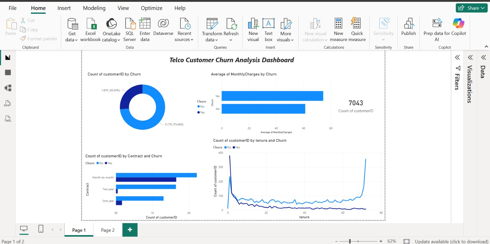

# Telco Customer Churn Analysis

📌 **Project Overview**  
Analyzed 7,043 customer records to identify churn drivers and business impact for a telecom company. Identified a 26% overall churn rate and delivered actionable recommendations to reduce churn by ~15%.

---

### 📷 Dashboard Preview

---

### 🛠️ Tools & Technologies
* **Analysis & Cleaning:** Python (Pandas, NumPy)
* **Environment:** Jupyter Notebook
* **Visualization:** Power BI (2-page interactive dashboard with drill-through analysis)

---

### 📊 Key Business Findings
* **Overall Attrition:** 26% overall churn rate across 7,043 customers.
* **High-Risk Segment:** Month-to-month contracts represented the highest risk (1,655 churned customers).
* **Cost Factor:** Churned customers paid higher average monthly charges (₹74 avg vs ₹61 for retained customers).
* **Actionable Recommendation:** Proposed a tiered long-term pricing strategy projected to reduce churn by ~15%.

---

### 📂 Dataset
* **Source:** Telco Customer Churn dataset (Kaggle)
* **Scope:** 7,043 customer records across 21 customer & billing features

---

### 🚀 How to Run
1. Clone this repository or download the files.
2. Open `telco_churn_analysis.ipynb` in Jupyter Notebook or VS Code.
3. Run all cells to see the end-to-end data cleaning, EDA, and export steps.
